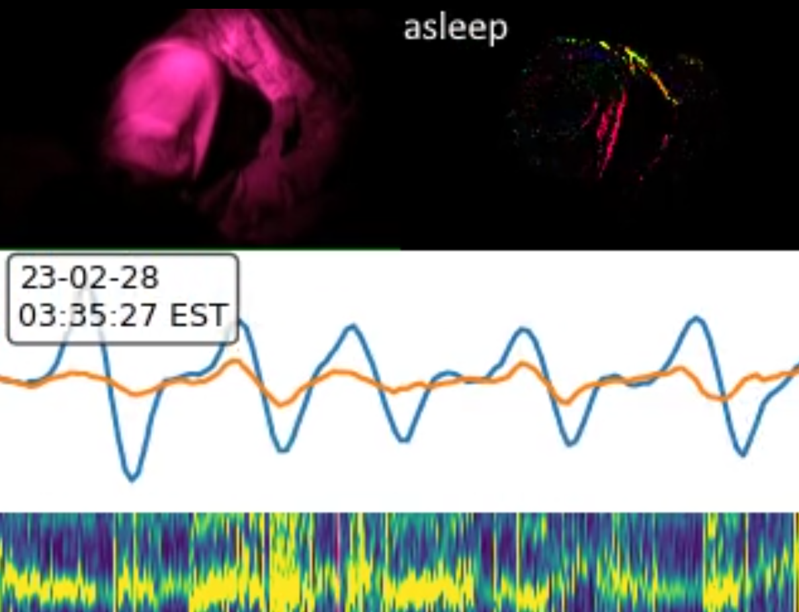
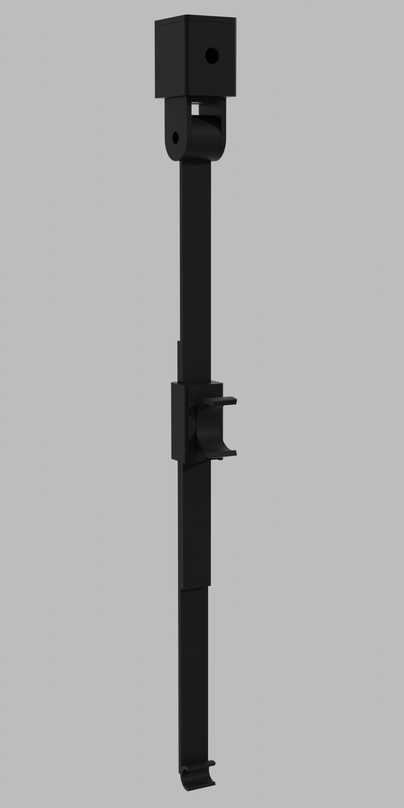

# Sleep Tracking System (SleepyPi)

An infrared camera based sleep tracking system built using Raspberry Pi. Uses infrared LEDs to illuminate the subject and then watches their motion to detect breathing rate and movements to classify and monitor sleep.

## Features

- Currently most higher order analysis is performed in a post-processing step, which segments the signal into asleep, awake, out of bed, movement, twitch, and aperiodic breathing.
- Each morning, a video report is generated which highlights movement and abnormal breathing throughout the night, along with a spectrogram of their breathing, to give an overview of sleep quality.
- The user is able to interact with the system via a set of TCP messaging widgets on their smartphone, to begin or end tracking.

## Roadmap

- The next major milestone will be to perform breathing rate analysis in realtime, in a computationally inexpensive way, to enable smart alarms that wake the user up at the optimal time in their sleep cycle. The ability to set and start an alarm is already present in the code, but the realtime analysis is still under development.
- Adding the ability to track multiple people at once, especially to disentangle crosstalk due to position shifts.
- More coarse grained analysis provided in the mornings as e.g. an email or text, to give a higher level quick overview.

## Gallery

A screenshot of the generated video. At the top left is the captured video feed, at the top right is the calculated velocity field, in the middle is the overall calculated movement signal, and at the bottom is the movement signal's spectrogram.

A 3D printed adjustable armature for the NoIR camera module that clips to a bed frame. This holder is adjustable in height, and the azumuth and altitude angles:

